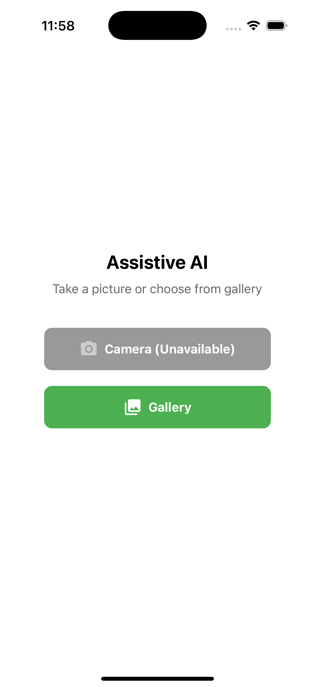
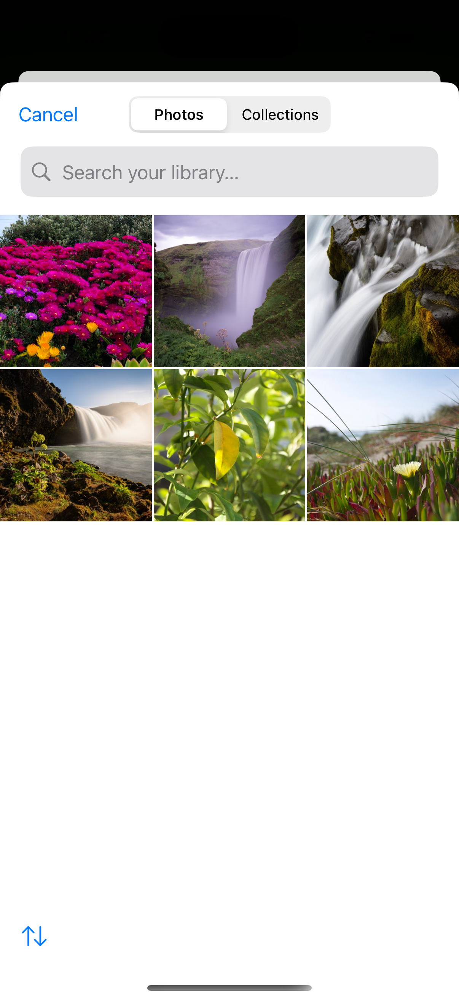
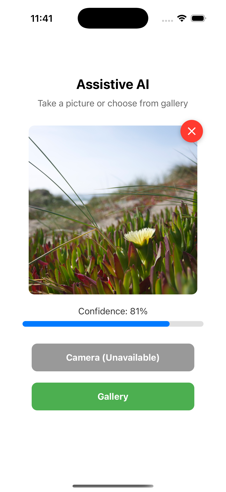

# 🔍 DetectKit

**DetectKit** is a lightweight, open-source mobile toolkit for image-based detection using **any AI model**. Built with **React Native + Expo**, it supports real-time image upload and response rendering from customizable backend APIs. Use it with zero-shot models like **CLIP**, object detectors like **YOLO**, or even your own ML pipelines.

---

## 📱 Features

- 📸 Capture or upload image from mobile
- 🧠 Send to any backend for inference (REST API)
- 🔊 Read out the response via device text-to-speech
- 🧩 Modular and backend-agnostic design
- 🌐 Works in tunnel, LAN, or cloud environments
- 🧪 Built with React Native and Expo SDK

---

## 📸 Screenshots

<div align="center">
  
  
  
</div>

*Note: Add your screenshots to the `screenshots` directory*

---

## 🔧 Backend API Contract

Your backend must expose the following endpoints:

1. GET `/health` - Health check endpoint
   - Returns: `{ "status": "ok" }`

2. POST `/upload` - Image upload endpoint
   - Accepts: `multipart/form-data` with a single field: `file` (the image)
   - Returns JSON response in this format:

```json
{
  "confidence": number,
  "message": string
}
```

## 📁 Project Structure

```
/
├── components/     # Reusable UI components
├── screens/        # Screen components
├── utils/          # Utility functions
├── assets/         # Static assets
├── config/         # Configuration files
├── screenshots/    # App screenshots
└── App.js          # Main application entry
```

## 🎨 Branding

The app's branding can be easily customized by modifying the `config/branding.js` file:

```javascript
export const BRANDING = {
  title: 'Assistive AI',
  subtitle: 'Take a picture or choose from gallery',
};
```

## 📋 Prerequisites

Before getting started, make sure you have the following installed:

- [Node.js](https://nodejs.org/) (v18 or later)
- [pnpm](https://pnpm.io/) (v8 or later)
- [Expo CLI](https://docs.expo.dev/get-started/installation/) (v6 or later)

You can verify your installations with:

```bash
node --version
pnpm --version
npx expo --version
```

## 🚀 Quick Start

```bash
# 1. Clone the repo
git clone https://github.com/iAnisDev/detectkit.git
cd detectkit

# 2. Install dependencies using pnpm
pnpm install

# 3. Start the app
pnpm expo start
```

## 📱 Development

### Running the App

After starting the app, you'll see the Expo development server interface with the following options:

```
› Metro waiting on exp://192.168.1.5:8081
› Scan the QR code above with Expo Go (Android) or the Camera app (iOS)

› Web is waiting on http://localhost:8081

› Using Expo Go
› Press s │ switch to development build

› Press a │ open Android
› Press i │ open iOS simulator
› Press w │ open web

› Press j │ open debugger
› Press r │ reload app
› Press m │ toggle menu
› shift+m │ more tools
› Press o │ open project code in your editor

› Press ? │ show all commands
```

### Mobile Setup

#### iOS
1. Install [Xcode](https://developer.apple.com/xcode/) from the Mac App Store
2. Install [Expo Go](https://apps.apple.com/us/app/expo-go/id982107779) from the App Store
3. Scan the QR code with your iPhone's camera app

#### Android
1. Install [Expo Go](https://play.google.com/store/apps/details?id=host.exp.exponent) from the Play Store
2. Scan the QR code with Expo Go app

### Development Tools

| Command | Description |
|---------|-------------|
| `i` | Open iOS simulator (requires Xcode) |
| `a` | Open Android emulator (requires Android Studio) |
| `w` | Open web version |
| `r` | Reload the app |
| `j` | Open the debugger |
| `m` | Toggle the developer menu |

### Troubleshooting

#### Common Issues

1. **Port Already in Use**
   ```bash
   # Kill the process using port 8081
   kill $(lsof -t -i:8081) 2>/dev/null || true
   ```

2. **Watchman Warning**
   ```bash
   watchman watch-del '/path/to/project' ; watchman watch-project '/path/to/project'
   ```

3. **Network Issues**
   - Ensure your mobile device and computer are on the same network
   - Check if your firewall is blocking the connection
   - Try using a different port with `expo start --port 19000`

4. **iOS Specific**
   - Ensure you're signed in to your Apple ID in Xcode
   - Check if your device is trusted in Xcode
   - Verify that the development team is selected in Xcode

5. **Android Specific**
   - Ensure you have an emulator set up in Android Studio
   - Check if USB debugging is enabled on your device
   - Verify that the correct Android SDK is installed

## 🌐 Community & Contributions

Have a feature request or model idea? Open a pull request or start a discussion!

## 📄 License

MIT License © 2024 [Anis]
